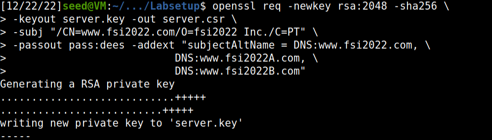

# SEED labs - PKI 

## Setup

After building the composer image you need to run 'docker-compose up' or its alias 'dcup' to have the container running in the background.


List of container ID's:


Using 'docksh' and the first few characters of the container ID will give you access to the shell of the container.


We need to set up a HTTPS web server with a name, so we add the following entries to 'etc/hosts'

```shell
10.9.0.80 www.bank32.com
10.9.0.80 www.fsi2022.com
```
## Task 1 - Becoming a Certificate Authority (CA)

We need to change openssl configuration, so we will copy the configuration file to our current directory and instruct OpenSSL to use this copy

```
cp  /usr/lib/ssl/openssl.cnf .
```
Uncommented 'unique_subject' parameter, just like requested.


We generate a CA with the following command

```
openssl req -x509 -newkey rsa:4096 -sha256 -days 3650 \
-keyout ca.key -out ca.crt
```

After we fill the asked information the output of the command will be stored in two files: ca.key and ca.crt.

The ca.key contains the private key, while ca.crt contains the public-key certificate.


### Questions

1. What part of the certificate indicates this is a CA’s certificate?

    Basic Constrainst, flag identifying certificate is CA.


1. What part of the certificate indicates this is a self-signed certificate?

    Issuer and subject of the certificate are equal.


1. In the RSA algorithm, we have a public exponent e, a private exponent d, a modulus n, and two secret numbers p and q, such that n = pq. Please identify the values for these elements in your certificate and key files.

* Modulus


* Exponents


* Primes


Observation: Answers for question 1 and 2 come from the ouput of the following command:
```
openssl x509 -in ca.crt -text -noout
```

And question 3 comes from this command:

```
openssl rsa -in ca.key -text -noout
```

## Task 2: Generating a Certificate Request for Your Web Server

We want to generate a CSR for www.fsi2022.com, to give it a public-key certificate from our CA. <br>
The CSR will be sent to the CA, who will
verify the identity information in the request, and then generate a certificate.

The following command will generate a CSR for www.fsi2022.com

```
openssl req -newkey rsa:2048 -sha256 \
-keyout server.key -out server.csr \
-subj "/CN=www.fsi2022.com/O=fsi2022 Inc./C=PT" \
-passout pass:dees -addext "subjectAltName = DNS:www.fsi2022.com, \
                          DNS:www.fsi2022A.com, \
                          DNS:www.fsi2022B.com"
```



The command will generate a pair of public/private key then create a signing request from the public key.

The following command will look at the decoded content of the CSR and private key files:

```
openssl req -in server.csr -text -noout
openssl rsa -in server.key -text -noout
```
### Add alternative names
Adding the following option to the CSR generator command we will add alternative names to my certifcate signing request: 
````
-addext "subjectAltName = DNS:www.fsi2022.com, \
                          DNS:www.fsi2022A.com, \
                          DNS:www.fsi2022B.com"
````

## Task 3

Now, we can turn the CSR created previously into a certficate 'server.crt', using the CA's 'ca.crt' and 'ca.key' by running the following command:

```
openssl ca -config myCA_openssl.cnf -policy policy_anything \
-md sha256 -days 3650 \
-in server.csr -out server.crt -batch \
-cert ca.crt -keyfile ca.key
```

The above command :

* 'myCA_openssl.cnf' is the configuration file we copied from /usr/lib/
ssl/openssl.cnf and made some changes in task 1
* The default setting in 'myCA_openssl.cnf' does not allow 'openssl ca' so we need to enable that by uncommenting the following line:

```
# Extension copying option: use with caution.
copy_extensions = copy
```
After editing 'myCA_openssl.cnf' we transform the CSR into a certificate


## Task 4 - Deploying Certificate in an Apache-Based HTTPS Website

We will deployed our certicate into an apache-based HTTPS based website, hosted in a docker container:
    
* Configure 'bank32_apache_ssl.conf' so that it corresponds to our server's data and mover server.crt and server.key to the right path.
```
<VirtualHost *:443> 
    DocumentRoot /var/www/bank32
    ServerName www.fsi2022.com
    ServerAlias www.fsi2022A.com
    ServerAlias www.fsi2022B.com
    DirectoryIndex index.html
    SSLEngine On 
    SSLCertificateFile /certs/server.crt
    SSLCertificateKeyFile /certs/server.key
</VirtualHost>

<VirtualHost *:80> 
    DocumentRoot /var/www/bank32
    ServerName www.fsi2022.com
    DirectoryIndex index_red.html
</VirtualHost>

# Set the following gloal entry to suppress an annoying warning message
ServerName localhost

# Set the following gloal entry to suppress an annoying warning message
ServerName localhost
```
* Build and Launch the docker container


After acessing container root (like in the setup section of this logbook) you copy certificate and key from the volumes directory
```
root@cf2ba8dc58e9:/certs# cp /volumes/server.crt .
root@cf2ba8dc58e9:/certs# cp /volumes/server.key .
```

* Enable the SSL module and the sites described in this file with following commands when the container is built:

```
# a2enmod ssl // Enable the SSL module
# a2ensite bank32_apache_ssl // Enable the sites described in this file
```

* Start the apache server with the following commands in the container:

```
// Start the server
# service apache2 start
```


If we go to the browser and go the URL 'https://www.fsi2022.com/' we will see a warning instead of the 'Hello, world!' page, this is due to the fact that our browser in this case Firefox doesn't know the Issuer.


After we load the certicate into Firefox (file 'ca.crt', which is public-key certificate) we will be able to visit the desired webpage and Firefox will recognize it as safe.


The certificate will be the one we created before as you can see here in this screenshot.


# Task 5 - Launching a Man-In-The-Middle Attack

We want to prove how strong is PKI against MITM attacks, so we will setup a malicious website 'www.example.com' to impersonate 'www.fsi2022.com'.

First we change the servername to 'www.example.com' in the bank32_apache_ssl file, like this:
```
<VirtualHost *:443> 
    DocumentRoot /var/www/bank32
    ServerName www.example.com
    ServerAlias www.fsi2022A.com
    ServerAlias www.fsi2022B.com
    DirectoryIndex index.html
    SSLEngine On 
    SSLCertificateFile /certs/server.crt
    SSLCertificateKeyFile /certs/server.key
</VirtualHost>

<VirtualHost *:80> 
    DocumentRoot /var/www/bank32
    ServerName www.fsi2022.com
    DirectoryIndex index_red.html
</VirtualHost>

# Set the following gloal entry to suppress an annoying warning message
ServerName localhost
```
Then we modify the victims machine's '/etc/hosts' file to emulate the result of a DNS cache positing attack my mapping the hostname 'www.example.com' to our 'malicious web server'.


When we visit the page with URL 'https://example.com' we will see the following:


This is due to the fact that the 'www.example.com' does not match any of the names in the CA, proving the efficiency of the use of PKI infrastructure against Man-In-The-Middle Attacks. 

# Task 6 - Launching a Man-In-The-Middle Attack with a Compromised CA

In this task we will demonstrate how is performed a sucessful MITHM attack.

First we change our apache configuration so that we can acess "example.com":

```
<VirtualHost *:443> 
    DocumentRoot /var/www/bank32
    ServerName www.example.com
    ServerAlias www.fsi2022A.com
    ServerAlias www.fsi2022B.com
    DirectoryIndex index.html
    SSLEngine On 
    SSLCertificateFile /certs/server2.crt
    SSLCertificateKeyFile /certs/server2.key
</VirtualHost>

<VirtualHost *:80> 
    DocumentRoot /var/www/bank32
    ServerName www.example.com
    DirectoryIndex index_red.html
</VirtualHost>

# Set the following gloal entry to suppress an annoying warning message
ServerName localhost

```
We proved in the previous task that if the CA isn't made for the 'https://example.com', the browser will give an alert making the attack harder to be sucessful since the user is already aware of the danger.

In our experience, we will assume that the attacker stole the CA's private key.
So we will be able to generate the certificate for our scam website 'www.example.com' to do this we have to use the command in Task 2 but specifying for 'www.example.com' :

```
openssl req -newkey rsa:2048 -sha256 -keyout server.key -out server.csr -subj "/CN=www.example.com/O=Example Inc./C=PT" -passout pass:dees
```


And then sign our CA with the following command:

```
openssl ca -config myCA_openssl.cnf -policy policy_anything \
-md sha256 -days 3650 \
-in server.csr -out server.crt -batch \
-cert ca.crt -keyfile ca.key
```


After that we will send the certs to the Docker and reload the apache server.


This time we will be able to visit the web page because the CA was compromised and an attacker can sign the certicate and impersonate a website.


## CTF Challenges

## Challenge 1

For this challenge, we want to decypher some messages. To start we need to find the signal. In this challenge we can find it by using the command "nc ctf-fsi.fe.up.pt 6000" that gets us: "000000000000000000000000000000000000000000000000000000000000000000000000000000000000000000000000000000000000000000000000000000000000000000000000000000000000000000000000000000000000000000000000000000000000000000000000000000000000000000000000000000000000000022f9284cc3e7fd3e1024b88ca52b463943c1acbe4a69b6be3c9009c47fbfd62c3c3ccb45b2bcbcba6571a47cf1abc9552b9792bf4b46a6736196dc3140863ed4311e5250031dcf1192f5c35b9b403f384de31a79c3da7c2fbcfb31eca13b446ce6529ee964879615066affce3d6568d65fce999ee6e9d8ee4b23dcf1210ba258
"

Then, we write this encrypted signal on the variable enc_flag with b before the encrypted signal.
The e variable from the template is in binary and switching to decimal equals 65537.
The variable n is equal to the multiplication between p and q, which are two random large prime numbers while d is the private key as the inverse of e given private total.
```
from binascii import hexlify, unhexlify
from sympy import *

p = nextprime(2512)
q = nextprime(2513)
n = p*q
total = (p-1)*(q-1)
e = 65537
d = pow(e, -1, total)


enc_flag = b"000000000000000000000000000000000000000000000000000000000000000000000000000000000000000000000000000000000000000000000000000000000000000000000000000000000000000000000000000000000000000000000000000000000000000000000000000000000000000000000000000000000000000022f9284cc3e7fd3e1024b88ca52b463943c1acbe4a69b6be3c9009c47fbfd62c3c3ccb45b2bcbcba6571a47cf1abc9552b9792bf4b46a6736196dc3140863ed4311e5250031dcf1192f5c35b9b403f384de31a79c3da7c2fbcfb31eca13b446ce6529ee964879615066affce3d6568d65fce999ee6e9d8ee4b23dcf1210ba258"

def enc(x):
    int_x = int.from_bytes(x, "big")
    y = pow(int_x,e,n)
    return hexlify(y.to_bytes(256, 'big'))

def dec(y):
    int_y = int.from_bytes(unhexlify(y), "big")
    x = pow(int_y,d,n)
    return x.to_bytes(256, 'big')

y = dec(enc_flag)
print(y.decode())
```
After we run the script with the changes done, we get the flag.


