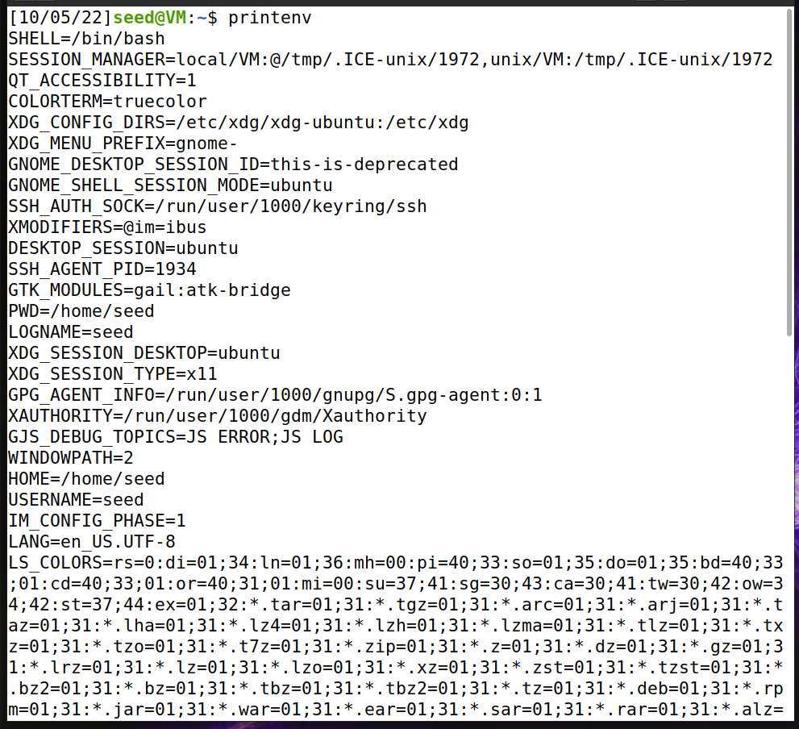
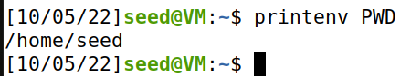

# **Week #4**

### **SEEDs Lab**
Environment Variable and Set-UID Program Lab

### **Task 1 - Manipulating Environment Variables** 

- Used printenv/env to print out the environment variables. 

**TERMINAL PRINT ON TASK 1**




We also used the **printenv PWD** command and got the following output: 



### **Task 2 - Passing Environment Variables from Parent Process to Child Process**

- We compiled the program given **(gcc myprintenv.c -o childprint.out gcc myprintenv.c -o parentprint.out)** into two binaries, each differing on which process would print the environment variables (parent or child)

- Run both programs and directed their output to different files. The output was the environment variables they received

- Using the diff command as mentioned on step 3, we concluded that the output was the same for both programs

- **Conclusion:** The environment variables for a parent process and its child process, created through fork with default configuration, are the same

**Program given:** 

``` c
#include <unistd.h>
#include <stdio.h>
#include <stdlib.h>

extern char **environ;
void printenv()
{
  int i = 0;
  while (environ[i] != NULL) {
      printf("%s\n", environ[i]);
      i++;
  }
}

void main()
{
  pid_t childPid;
  switch(childPid = fork()) {
    case 0:  /* child process */
      printenv();          
      exit(0);
    default:  /* parent process */
      //printenv();       
      exit(0);
  }
}
```
**TERMINAL PRINT ON TASK 2**


### **Task 3 - Environment Variables and execve()**

- In this task we compiled the program given **(myenv.c)** . This program starts another process through **execve** and prints its environment variables. 

- We did not found any output using the **execve("/usr/bin/env", argv, NULL)**  We think that the reason for this happening is because 'execve' function starts a process and associates to it the array of environment variables given to it in the third argument. As this argument was a NULL pointer, the new process has no environment variables.

- As soon as we changed to **execve("/usr/bin/env", argv, environ)** we got we got the the parent's process environment variables as expected.


``` c
#include <unistd.h>

extern char **environ;
int main()
{
  char *argv[2];

  argv[0] = "/usr/bin/env";
  argv[1] = NULL;
  execve("/usr/bin/env", argv, environ);  

  return 0 ;
}
```

**TERMINAL PRINT ON TASK 3**


### **Task 4 - Environment Variables and system()**

Code given: 

``` c
#include <stdio.h>
#include <stdlib.h>

int main()
{
    system("/usr/bin/env");
    return 0 ;
}
```

- We created a file called systemteste.c, after compiling we found that the file calls a similar process to the task 3, using system instead of execve. 

- The output was once more the parent process environment variables, since the "system" function uses "execl", which calls "execve" with the parent process environment variabels, which finally executes /bin/sh with the argument written to "system"


**TERMINAL PRINT ON TASK 4**


### **Task 5 - Environment Variable and Set-UID Programs**

Code given: 

``` c
int main()
{
int i = 0;
while (environ[i] != NULL) {
    printf("%s\n", environ[i]);
    i++;
  }
}
```

**TERMINAL PRINT ON TASK 5**


- We created a file called setuid.c, after we compilled we gave permissions to root and exported the following variables: PATH, LD_LIBRARY_PATH, ANY_NAME;

-The output 

### **Task 6 - The PATH Environment Variable and Set-UID Programs**

Code given: 

``` c
int main()
{
  system("ls");
  return 0;
}
```

- We created a file called myls.c, after we compilled to an executable (./ls) we exported the its path, to the PATH variable making it possible to run like if it was the original bash command, giving the possibility the run malicious code.


